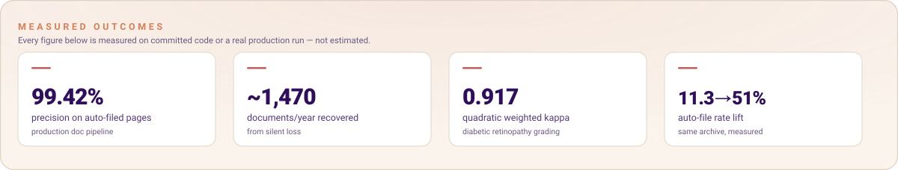

<picture>
  <source media="(prefers-color-scheme: dark)" srcset="assets/hero-dark.svg">
  <source media="(prefers-color-scheme: light)" srcset="assets/hero-light.svg">
  
</picture>

I build AI systems that hold up outside a notebook. The parts I care about are the
unglamorous ones: what happens when an agent is wrong, how you regression-test a pipeline
whose output changes every run, and where a human has to sit in the loop before software
spends someone's money or throws away a record.

My research interest is **CI/CD for non-deterministic systems** — which parts of an agent
pipeline can safely gate a build, and which can only be monitored.

<picture>
  <source media="(prefers-color-scheme: dark)" srcset="assets/impact-dark.svg">
  <source media="(prefers-color-scheme: light)" srcset="assets/impact-light.svg">
  
</picture>

---

## Featured work

### [ecr-document-pipeline](https://github.com/azamali992/ecr-document-pipeline) &nbsp;·&nbsp; in production

Reads the stamped or handwritten number off scanned warehouse paperwork, classifies each
form, and files every page under its own number. OCR + a three-way zoom-consensus gate +
a from-scratch CRNN digit model + a visual page classifier.

Auto-filing went **11.3% → 51.0% at 99.42% precision** — but the finding worth more than
the speed-up came from auditing the pipeline's own discard pile: **~21% of discarded pages
were genuine records**, roughly **1,470 documents a year being lost silently**. Runs fully
offline; no per-page cloud cost, no document leaves the network.

`RapidOCR` `ONNX` `CRNN/CTC` `document AI` `offline inference`

### [munshi](https://github.com/azamali992/munshi) &nbsp;·&nbsp; product

**Your AI back office, in your pocket.** Six approval-gated agents — order, godown,
delivery, hisaab, wasooli, and a manager that only routes — run a small distributor's whole
order-to-cash loop inside one self-contained mobile PWA. No ERP, no cloud dependency.
Roles are enforced as tool boundaries, every stop is closed against the **customer's OTP**,
and a 21-step scripted business day gates CI with a safety invariant checked from the audit
log **independently of the risk registry** — un-gating one money tool fails the build.

`LangChain 1.4` `LangGraph` `multi-agent` `PWA` `FastAPI` `SQLite` `MLflow`

### [agentic-ops-platform](https://github.com/azamali992/agentic-ops-platform)

Multi-agent back-office automation where **every state-changing action is human-approval-gated
by construction**. A supervisor routes to order/inventory/billing specialists; role-based
middleware controls which tools a caller can even see; one risk registry is enforced on two
surfaces — LangChain's `HumanInTheLoopMiddleware` **and** a real MCP server — so a client
can't use one to bypass the other. 88 tests that assert on database state, not on what the
model said.

`LangChain 1.4` `LangGraph` `MCP` `MLflow` `human-in-the-loop`

### [agentic-rag-eval-gate](https://github.com/azamali992/agentic-rag-eval-gate)

A RAG agent (retrieve → grade → rewrite/retry → generate → self-check) with an 18-case eval
harness and a CI gate that blocks deterministic regressions while tolerating normal LLM
variance. Proven by deliberately breaking retrieval and watching the gate fail the build —
a gate that can't fail isn't a gate.

`RAG` `BM25` `CI quality gating` `evaluation`

### [multichannel-order-to-erp-agent](https://github.com/azamali992/multichannel-order-to-erp-agent)

Turns informal multilingual chat orders (WhatsApp, code-switched Urdu/English) into confirmed
ERP orders: LLM extraction → tiered fuzzy matching → human confirmation → ERP sync. Built
from a real automation problem at a chemicals distributor.

`LLM extraction` `RapidFuzz` `FastAPI` `Postgres` `Docker`

### [streaming-cdc-medallion-pipeline](https://github.com/azamali992/streaming-cdc-medallion-pipeline)

Real-time CDC streaming pipeline: Bronze/Silver/Gold medallion architecture with
Delta-Lake-style change data feed, MERGE upsert/delete, windowed aggregation, and
checkpointed consumers that resume without reprocessing.

`Delta Lake patterns` `structured streaming` `data engineering`

### [diabetic-retinopathy-grading](https://github.com/azamali992/diabetic-retinopathy-grading)

Two-stage CORAL ordinal regression cascade for diabetic retinopathy grading (APTOS 2019),
**QWK 0.917**, stage-1 binary AUC 0.9986. DenseNet121, focal/SORD/EMD losses, SAM + SWA,
multi-scale TTA, GradCAM interpretability — and the full experiment history, not just the
winning run.

`PyTorch` `medical imaging` `ordinal regression` `interpretability`

---

## Also here

| | |
|---|---|
| [**cnn-shortcut-learning-gradcam**](https://github.com/azamali992/cnn-shortcut-learning-gradcam) | Diagnosing shortcut learning with a controlled biased/unbiased CNN setup |
| [**mental-health-rag-chatbot**](https://github.com/azamali992/mental-health-rag-chatbot) | RAG chatbot backend (FastAPI + LangChain + ChromaDB) behind the TherapyLink app |
| [**fyp_therapylink**](https://github.com/azamali992/fyp_therapylink) | Cross-platform Flutter mental-health app: AI psychologist, sentiment analysis, mood tracking |
| [**cold-email-generator**](https://github.com/azamali992/cold-email-generator) | Scrapes a careers page, extracts postings with an LLM, drafts a tailored email from matched portfolio work |
| [**haramtextile**](https://github.com/azamali992/haramtextile) · [**mhglobal**](https://github.com/azamali992/mhglobal) · [**mclwebsite**](https://github.com/azamali992/mclwebsite) | Production full-stack B2B sites + admin CMS (Next.js/TS/Prisma, MERN) — one with 162 unit + 19 E2E tests |

---

## Working with

**AI / GenAI** &nbsp; LangChain · LangGraph · MCP · RAG · agent middleware · human-in-the-loop design · LLM evaluation

**ML** &nbsp; PyTorch · TensorFlow · scikit-learn · computer vision · OCR · ordinal regression · model interpretability

**MLOps / Data** &nbsp; MLflow · Spark · Delta Lake · structured streaming · CI quality gates · ONNX · Docker · GitHub Actions

**Backend / Product** &nbsp; Python · FastAPI · Node.js · Next.js/TypeScript · PostgreSQL · MongoDB · Oracle APEX · Flutter

---

Co-founder at [AZEKTRA](https://azektra.com) — automation, web and industrial systems. &nbsp;·&nbsp; azamaliafzal992@gmail.com
